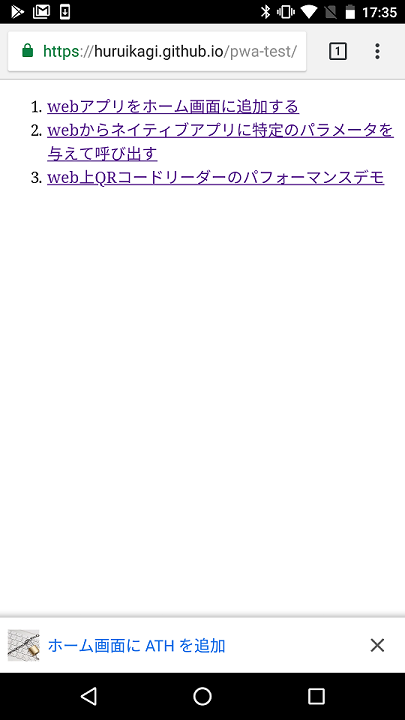
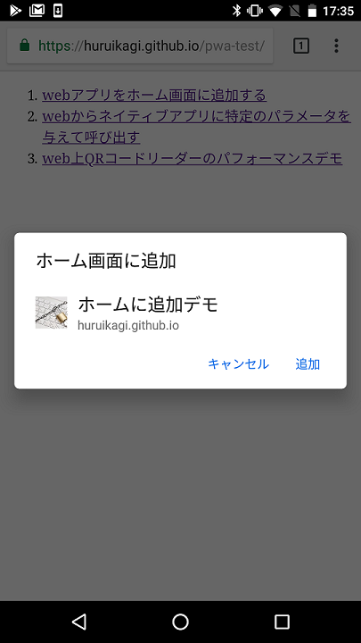
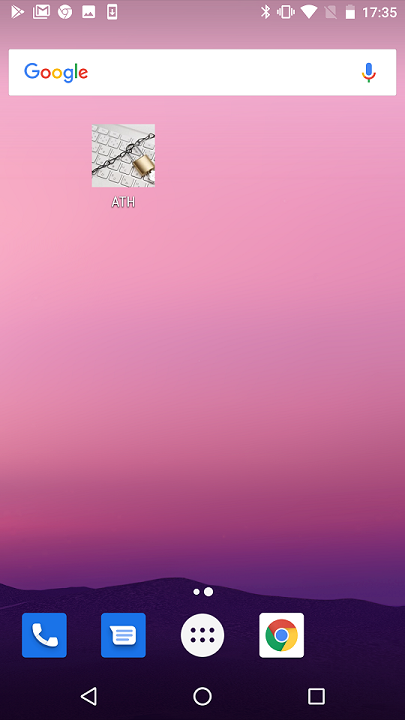
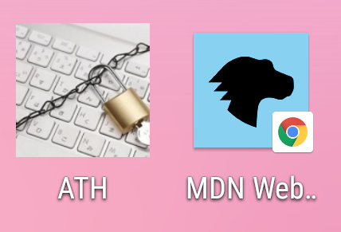
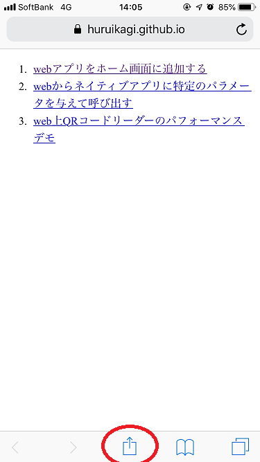
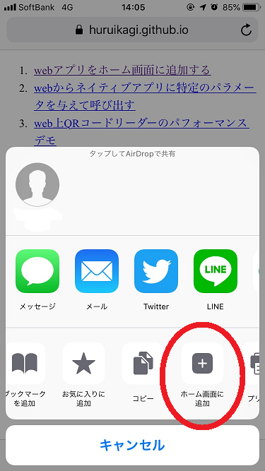
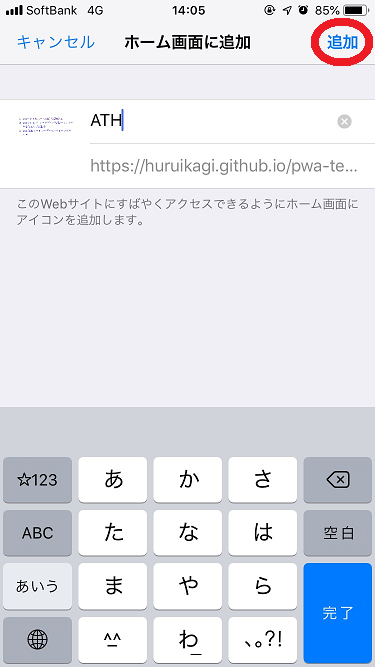

# 1. ホーム画面に追加

Webアプリを各OSでホーム画面に追加する手順をまとめます。

## Android

### PWAを使う

[サンプル](https://huruikagi.github.io/pwa-test/add-to-home.html)

+ HTTPS
+ manifest.jsonを適切に設置
+ Service Workerが登録されている

以上の条件を満たしたページをChromeで表示すると、  
下に示すスクリーンショットのようにインストールバナーが表示されます。

バナーの「ホーム画面に（アプリケーション短縮名）を追加」をタップすると、以下のようなダイアログが表示されます。

この確認ダイアログで「追加」をタップすると、インストールが実行され、ホーム画面にアイコンが追加されます。

#### 補足

インストールバナーの表示タイミングはある程度開発者側で制御できるようです。  
（自由に発火できるわけではなく、Chromeが表示しようとしたのをハンドリングしてディレイかけられる程度）  
参考: https://developers.google.com/web/fundamentals/app-install-banners/?hl=ja

また、ユーザーがインストールを拒否した場合（バナーで×を押す・ダイアログでキャンセルを押す）、  
あるいは一度インストールした後にアンインストールされた場合、
再度インストールバナーを表示する方法は見当たりませんでした。

### PWAを使わない

ユーザーの能動的な操作によりwebサイトを追加することができます。

1. Chromeで該当のwebサイトを表示する
2. 右上の（点が縦に三つのボタン）をタップ
3. 「ホーム画面に追加」をタップ

注意点として、この手順で追加されたアイコンには右下に小さくChromeのマークが表示されることがあります。
> アイコンにChromeのミニアイコンが付加される問題
> https://detail.chiebukuro.yahoo.co.jp/qa/question_detail/q11185711866

PWAとして動作していないページだと、単なるショートカットであるということを示すためにChromeのアイコンが表示されているようです。
逆に、PWAとして動作しているページを（インストールバナー経由ではなく）この手順でホームに追加した場合は、PWAとしてインストールが実行されるようです。オフライン動作や全画面表示が実行できます。

## iOS

### PWAを使う

2018/10/16現在、 **iOS/SafariではPWAのインストールバナーは表示されません。**  
下記の「PWAを使わない」場合と同様の操作手順を行う必要があります。

ホームに追加した際の動作は（単なるリンクの作成ではなく）PWAとしてのインストールが行われるため、  
URLバーの非表示やオフライン動作などが行えることは確認しました。

### PWAを使わない

ユーザーの能動的な操作によりwebサイトをホームに追加することができます。  
Safariで該当のwebサイトを表示している状態で、画面下部の共有アイコンをタップします。

表示されるメニューの中から「ホーム画面に追加」をタップします。

ホーム画面上で表示されるアプリ名を編集できる画面が表示されます。
右上の「追加」をタップすると実際にホーム画面に追加されます。

#### 補足

Chromeなど、Safari以外のブラウザを利用していると、「共有」内に「ホーム画面に追加」の項目がありません。
シェア的にはほぼ無視してもいいかもしれません。
