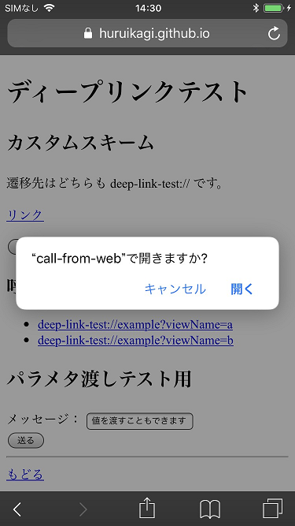

# ディープリンク

webブラウザからネイティブアプリにパラメタを渡して起動する方法についてまとめます。

## カスタムURLスキーム

アプリにあらかじめ設定をしておくことで、  
`https://` の部分を独自の文字列に変換したリンクをブラウザで開こうとした際に  
アプリが呼び出されるようにできる仕組みです。

例： [deep-link-test://example?viewName=a&message=hello](deep-link-test://example?viewName=a&message=hello)

パラメータを渡すことで指定の画面を開いたり、データを渡すこともできます。

[デモ用ページ](https://huruikagi.github.io/pwa-test/deep-link.html)

### Android

AndroidManifest.xml で任意の View に IntentFilter を追加します。
アプリがインストールされている状態で、該当スキームのURLにChromeから遷移しようとすると、
そのままアプリが起動します。

URLの情報は、該当の View 内で Intent から取得することができます。

### iOS

> 参考： Custom URL Schemeでアプリ内の任意のページを表示する
> https://qiita.com/yamataku29/items/67f12142522306c3f86a

info.plist から URL identifire と URL Schema の項目を適宜指定します。  
また、 AppDelegate.swift 内にURLを引数に取るapplication関数を宣言しておきます。

アプリがインストールされている状態で、該当スキームのURLにSafariから遷移しようとすると、
アプリで開くかどうかの確認ダイアログが表示されます。

「開く」をタップするとアプリが呼び出されます。

## Universal Links

> 参考： URLスキーム・独自ディープリンク実装に代わる、Universal Links(iOS 9で導入)でより良いUXを実現
> https://qiita.com/mono0926/items/2bf651246714f20df626

こちらはiOS限定の機能であるため、Androidでは別途カスタムURLスキームを利用するなどの対応が必要になります。
※ [Firebase App Indexing](https://firebase.google.com/docs/app-indexing/android/app?hl=ja) で同じことができるかもしれないので、後で追加で調査します。
